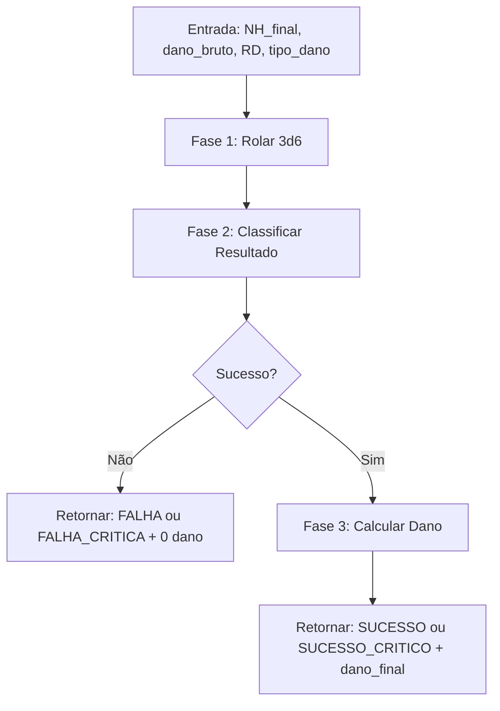

# PLAN: Lógica Interna do Calculador de Combate

**RPG:** A Era das Espadas Quebradas  
**Sistema Base:** GURPS 4ª Edição (subconjunto simplificado)  
**Tipo:** Lógica pura (engine) — sem UI nesta fase

---

## 1. Confirmação dos Parâmetros Lógicos

Todos os parâmetros absolutos foram compreendidos. Abaixo, a formalização sem ambiguidade:

### 1.1 Resolução de Ação (3d6)

| Regra | Definição Formal |
|-------|------------------|
| **Mecanismo** | Rolar 3d6, somar os dados |
| **Sucesso** | `rolagem ≤ NH_final` |
| **Falha** | `rolagem > NH_final` |

### 1.2 Tabela-Verdade: Sucesso Crítico

| Rolagem | Condição | Resultado |
|---------|----------|-----------|
| **3** | Sempre | ✅ Sucesso Crítico |
| **4** | Sempre | ✅ Sucesso Crítico |
| **5** | NH ≥ 15 | ✅ Sucesso Crítico |
| **6** | NH ≥ 16 | ✅ Sucesso Crítico |

> [!IMPORTANT]
> Rolagens 3 e 4 são sucesso crítico **independentemente** do NH — mesmo que o NH seja menor que a rolagem (ex: NH 2 e rolagem 3 = sucesso crítico, **não** falha).

### 1.3 Tabela-Verdade: Falha Crítica

| Rolagem | Condição | Resultado |
|---------|----------|-----------|
| **18** | Sempre | ❌ Falha Crítica |
| **17** | NH ≤ 15 | ❌ Falha Crítica |

### 1.4 Cálculo de Dano

```
dano_final = floor((dano_bruto - RD) * multiplicador)
```

| Tipo de Dano | Multiplicador |
|-------------|---------------|
| Contusão (cr) | ×1 |
| Corte (cut) | ×1.5 |
| Perfuração (imp) | ×2 |

### 1.5 Regra de Arredondamento

- **Sempre** `Math.floor()` (truncamento para baixo)
- O `floor` é aplicado **uma única vez**, no **resultado final** após multiplicação
- Exemplo: `(7 - 3) * 1.5 = 6.0` → `floor(6.0)` = **6**
- Exemplo: `(5 - 2) * 1.5 = 4.5` → `floor(4.5)` = **4**

> [!CAUTION]
> **Ponto crítico de erro**: O `floor` deve ser aplicado **depois** da multiplicação, **nunca** antes. Arredondar `(dano - RD)` antes de multiplicar geraria resultados incorretos.

---

## 2. Fluxo de Dados: Ataque → Dano

O fluxo é um **pipeline linear** com um ponto de decisão (gate) que impede que dano seja calculado sem sucesso no ataque.



### Fase 1 — Geração da Rolagem

```
rng → dado1 ∈ [1,6], dado2 ∈ [1,6], dado3 ∈ [1,6]
rolagem = dado1 + dado2 + dado3
```

**Saída:** `rolagem` (inteiro, intervalo 3–18)

---

### Fase 2 — Classificar Resultado (Truth Table)

A classificação segue uma **cadeia de prioridade** — a primeira condição verdadeira encerra a avaliação:

```
SE rolagem ∈ {3, 4}                         → SUCESSO_CRITICO
SE rolagem == 5  E  NH ≥ 15                  → SUCESSO_CRITICO
SE rolagem == 6  E  NH ≥ 16                  → SUCESSO_CRITICO
SE rolagem == 18                             → FALHA_CRITICA
SE rolagem == 17  E  NH ≤ 15                 → FALHA_CRITICA
SE rolagem ≤ NH                              → SUCESSO
SENÃO                                        → FALHA
```

**Saída:** `tipo_resultado` (enum: `SUCESSO_CRITICO | SUCESSO | FALHA | FALHA_CRITICA`)

> [!NOTE]
> A ordem importa. Um resultado de 3 com NH 2 é `SUCESSO_CRITICO` (regra especial), **não** falha (regra geral). As regras críticas têm precedência sobre a comparação `rolagem ≤ NH`.

---

### Fase 3 — Cálculo de Dano (Gate: só executa se sucesso)

```
SE tipo_resultado ∈ {SUCESSO, SUCESSO_CRITICO}:
    penetracao = max(dano_bruto - RD, 0)      ← Dano nunca é negativo
    multiplicador = obter_multiplicador(tipo_dano)
    dano_final = floor(penetracao * multiplicador)
SENÃO:
    dano_final = 0
```

> [!IMPORTANT]
> **Clamping a zero:** Se `dano_bruto - RD` for negativo, o resultado deve ser **0**, não negativo. Isso garante que `floor()` não produza dano negativo (ex: `floor(-1.5)` = -2, o que seria um bug).

---

## 3. Contrato de Dados (Entrada → Saída)

### Entrada

| Campo | Tipo | Restrição | Exemplo |
|-------|------|-----------|---------|
| `nh_final` | `int` | ≥ 3 | `12` |
| `dano_bruto` | `int` | ≥ 0 | `7` |
| `rd` | `int` | ≥ 0 | `3` |
| `tipo_dano` | `enum` | `"cr" \| "cut" \| "imp"` | `"cut"` |

### Saída

| Campo | Tipo | Exemplo |
|-------|------|---------|
| `dados` | `[int, int, int]` | `[2, 4, 3]` |
| `rolagem` | `int` | `9` |
| `tipo_resultado` | `enum` | `"SUCESSO"` |
| `dano_final` | `int` | `6` |

---

## 4. Casos de Teste (Tabela de Validação)

| # | NH | Rolagem | Tipo Dano | Dano Bruto | RD | Esperado: Resultado | Esperado: Dano |
|---|-----|---------|-----------|------------|-----|---------------------|----------------|
| 1 | 12 | 9 | cut | 7 | 3 | SUCESSO | `floor((7-3)*1.5)` = **6** |
| 2 | 12 | 9 | imp | 5 | 2 | SUCESSO | `floor((5-2)*2)` = **6** |
| 3 | 12 | 9 | cr | 5 | 2 | SUCESSO | `floor((5-2)*1)` = **3** |
| 4 | 12 | 9 | cut | 5 | 2 | SUCESSO | `floor((5-2)*1.5)` = **4** ← arredondamento |
| 5 | 10 | 3 | cut | 4 | 4 | SUCESSO_CRITICO | `floor((4-4)*1.5)` = **0** |
| 6 | 2 | 3 | cr | 5 | 0 | SUCESSO_CRITICO | **5** (3 e 4 sempre crítico) |
| 7 | 15 | 5 | cr | 6 | 1 | SUCESSO_CRITICO | **5** |
| 8 | 16 | 6 | cr | 6 | 1 | SUCESSO_CRITICO | **5** |
| 9 | 14 | 5 | cr | 6 | 1 | SUCESSO | **5** (NH < 15, regra 5 não aplica) |
| 10 | 12 | 18 | - | - | - | FALHA_CRITICA | **0** |
| 11 | 10 | 17 | - | - | - | FALHA_CRITICA | **0** (NH ≤ 15) |
| 12 | 16 | 17 | - | - | - | FALHA | **0** (NH > 15, regra 17 não aplica) |
| 13 | 12 | 13 | - | - | - | FALHA | **0** |
| 14 | 8 | 7 | cut | 3 | 5 | SUCESSO | `floor(max(3-5,0)*1.5)` = **0** ← RD > dano |

---

## 5. Decisões de Design Importantes

### 5.1 Onde aplicar `floor()`

```
❌ ERRADO:  floor(dano - RD) * multiplicador    ← arredonda cedo demais
❌ ERRADO:  (dano - RD) * floor(multiplicador)   ← destrói multiplicadores fracionários
✅ CORRETO: floor((dano - RD) * multiplicador)   ← uma operação, no final
```

### 5.2 Precedência de Regras Críticas

A classificação deve usar uma cadeia `if/else if` estrita, **não** checagens independentes. Isso evita que uma rolagem seja simultaneamente sucesso crítico e falha:

```
// Exemplo de conflito evitado:
// NH = 2, rolagem = 3
// Sem precedência: rolagem > NH (falha?) MAS rolagem == 3 (sucesso crítico?)
// Com precedência: Regra 3-4 vem PRIMEIRO → SUCESSO_CRITICO (correto)
```

### 5.3 Clamping de Penetração

`max(dano - RD, 0)` é aplicado **antes** da multiplicação para garantir que:
- Dano nunca seja negativo
- `floor()` sobre valor negativo não produza resultados absurdos

---

## Verification Plan

### Automated Tests
- Unit tests com os 14 casos da tabela de validação acima
- Testes de propriedade: `dano_final ≥ 0` para qualquer entrada válida
- Testes de borda: `NH = 3` (mínimo), `NH = 20`, `rolagem = 3`, `rolagem = 18`

### Manual Verification
- Conferir cada caso de teste manualmente com uma calculadora para confirmar os valores esperados
- Validar que a cadeia de classificação não produz resultados ambíguos

---

> ✅ **Status:** Plano lógico completo. Pronto para revisão.
