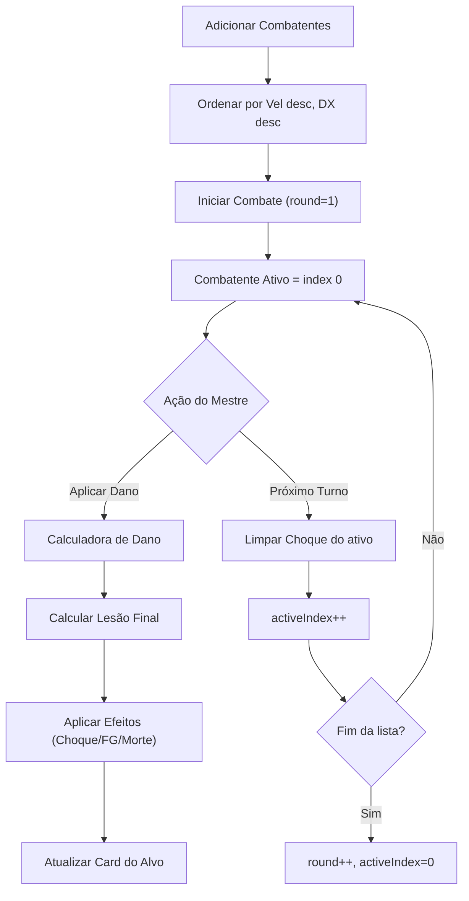

# PLAN: Escudo do Daimyo — Milestone 1
## Rastreador de Iniciativa + Calculadora de Dano Avançada

**App:** Escudo do Daimyo — Companion App para Mestres de RPG  
**Cenário:** "A Era das Espadas Quebradas" (Dark Fantasy Feudal Japonês)  
**Sistema:** GURPS 4ª Edição (subconjunto de combate)  
**Tipo:** SPA — HTML/CSS/JS (single file)  
**Projeto:** WEB → `frontend-specialist`

---

## Visão Geral

Transformar o calculador de combate existente (`index.html`) em um **Companion App completo** para mestres de RPG, com:

1. **Rastreador de Iniciativa** — gerencia ordem de combate por Velocidade Básica
2. **Cards de Combatente** — ficha rápida de cada personagem em combate
3. **Calculadora de Dano Avançada** — com Hit Locations, 4 tipos de dano, e efeitos automáticos GURPS

---

## Confirmação da Lógica de Negócio GURPS 4e

### 1. Iniciativa (Velocidade Básica)

| Regra | Definição Formal |
|-------|------------------|
| **Ordenação** | Decrescente pela Velocidade Básica (`Vel`) |
| **Desempate** | Maior Destreza (`DX`) vence |
| **Desempate Final** | Se `Vel` E `DX` forem iguais → pedir desempate manual |
| **Próximo Turno** | Cicla ao próximo combatente na lista; ao final, volta ao primeiro |

### 2. Modelo do Combatente (Card)

```
Combatant {
  id:       string      // UUID gerado
  name:     string      // Nome do personagem
  hpMax:    int ≥ 1     // PV Máximo (Hit Points)
  hpCur:    int         // PV Atual (pode ser ≤ 0)
  fpMax:    int ≥ 1     // PF Máximo (Fatigue Points)
  fpCur:    int         // PF Atual
  speed:    float       // Velocidade Básica (ex: 5.75, 6.00)
  dx:       int ≥ 1     // Destreza (para desempate)
  dr:       int ≥ 0     // RD base (Armadura)
  isActive: bool        // Se está no combate
  shockPenalty: int     // Penalidade de Choque (0 a -4), zera após turno
  conditions: string[]  // Tags visuais: "Atordoado", "Inconsciente", etc.
}
```

### 3. Calculadora de Dano (Fórmula Mestre)

A cadeia de cálculo possui **dois multiplicadores em série**:

```
1. dano_penetrante = max(0, dano_rolado - RD_efetiva)
2. lesao_final = floor(dano_penetrante × mult_tipo_dano × mult_local_acerto)
```

> [!IMPORTANT]  
> O `floor()` é aplicado **UMA VEZ**, no resultado final, após ambas as multiplicações.

### 3.1 Tipos de Dano (Multiplicador de Arma)

| Tipo | Abreviação GURPS | Código | Multiplicador |
|------|-------------------|--------|---------------|
| Contusão | esm / cr | `cr` | ×1 |
| Corte | cort / cut | `cut` | ×1.5 |
| Perfuração | perf / imp | `imp` | ×2 |
| Perfuração Pequena | pi- | `pi-` | ×0.5 |

### 3.2 Locais de Acerto (Hit Location)

| Local | Modificador de RD | Multiplicador de Dano | Observações |
|-------|--------------------|-----------------------|-------------|
| **Tronco** | Nenhum | ×1 (padrão) | Local default se nenhum escolhido |
| **Pescoço** | Nenhum | Corte/Perfuração → ×2 (substitui) | Contusão/pi- mantêm mult normal |
| **Crânio** | +2 na RD | ×4 no dano penetrante | Exceto dano tóxico/fadiga. O +2 na RD aplica ANTES do cálculo de penetração |
| **Vitais** | Nenhum | Perfuração → ×3 (substitui) | Apenas para `imp`. Outros tipos = mult normal |

> [!CAUTION]
> **Pescoço e Vitais** substituem o multiplicador do tipo de dano, não somam a ele. Exemplo: Perfuração no Pescoço = ×2 (do pescoço), **não** ×2 (perf) + ×2 (pescoço) = ×4.  
> **Crânio** é diferente: o ×4 é um multiplicador over o **dano penetrante** (que já foi calculado com RD+2), depois de considerar o tipo de arma.

### 3.3 Algoritmo Detalhado por Hit Location

```
FUNÇÃO calcularDano(dano_rolado, rd_base, tipo_dano, local_acerto):

  // Step 1: Ajustar RD pelo local
  rd_efetiva = rd_base
  SE local_acerto == "cranio":
    rd_efetiva = rd_base + 2

  // Step 2: Dano Penetrante
  dano_penetrante = max(0, dano_rolado - rd_efetiva)

  // Step 3: Determinar multiplicador
  mult_tipo = MULTIPLIERS[tipo_dano]  // cr=1, cut=1.5, imp=2, pi-=0.5

  SE local_acerto == "tronco":
    mult_final = mult_tipo  // Sem modificação

  SE local_acerto == "pescoço":
    SE tipo_dano IN ["cut", "imp"]:
      mult_final = 2        // SUBSTITUI o multiplicador do tipo
    SENÃO:
      mult_final = mult_tipo // pi- e cr usam seu mult normal

  SE local_acerto == "cranio":
    // O ×4 é aplicado APÓS o mult do tipo de dano
    lesao = floor(dano_penetrante * mult_tipo)
    lesao_final = lesao * 4
    RETORNAR lesao_final

  SE local_acerto == "vitais":
    SE tipo_dano == "imp":
      mult_final = 3        // SUBSTITUI o multiplicador do tipo
    SENÃO:
      mult_final = mult_tipo // Outros tipos mantêm mult normal

  // Step 4: Lesão Final
  lesao_final = floor(dano_penetrante * mult_final)
  RETORNAR lesao_final
```

> [!WARNING]
> **Crânio tem tratamento especial:** O ×4 multiplica a lesão JÁ calculada (pós-tipo), não o dano penetrante bruto. Isso é uma nuance do GURPS 4e (B552/B400). A fórmula para Crânio é:  
> `lesao_final = floor(dano_penetrante × mult_tipo) × 4`

### 4. Automação de Efeitos (Gatilhos Pós-Dano)

| Efeito | Gatilho | Comportamento Visual |
|--------|---------|---------------------|
| **Choque** | `lesao_final > 0` | Tag no card: "-X DX/IQ" (X = min(lesao_final, 4)). Some após o turno do personagem |
| **Ferimento Grave** | `lesao_final > floor(hpMax / 2)` em um único golpe | Alerta vermelho pulsante: "⚠ FERIMENTO GRAVE! Teste HT ou caia Atordoado" |
| **Risco de Morte** | `hpCur <= 0` (após aplicar dano) | Alerta persistente no card: "💀 RISCO: Teste HT a cada turno ou desmaia/morre" |

---

## Arquitetura de Dados

### Estado Global (CombatState)

```
CombatState {
  combatants: Combatant[]   // Lista ordenada por iniciativa
  activeIndex: int          // Índice do combatente ativo
  round: int                // Número do turno atual
  isStarted: bool           // Se o combate foi iniciado
}
```

### Fluxo de Dados



---

## Proposta de Layout (UI)

O app será dividido em **2 áreas principais** (substituindo o layout atual de 3 colunas):

| Área | Conteúdo |
|------|----------|
| **Esquerda (60%)** | Lista de Combatentes (cards) + Controles de Turno |
| **Direita (40%)** | Calculadora de Dano (com seletor de alvo, tipo, local) |
| **Footer** | Histórico de Combate (preservado) |

---

## Mudanças Propostas

### Componente: GURPS Combat Engine

#### [MODIFY] [index.html](file:///c:/Users/richa/Documents/Programação%202026.1/antigravity-project/index.html)

**Mudanças no Engine (JS):**
1. Adicionar tipo `pi-` (×0.5) ao `MULTIPLIERS`
2. Criar modelo `Combatant` e `CombatState`
3. Criar `CombatManager` com métodos: `addCombatant()`, `removeCombatant()`, `sortByInitiative()`, `nextTurn()`, `getCurrentCombatant()`
4. Expandir `calculateDamage()` para aceitar `hitLocation` e aplicar RD+2 (crânio), mult substituição (pescoço/vitais), e ×4 (crânio)
5. Criar sistema de efeitos: `applyShock()`, `checkSevereWound()`, `checkDeathRisk()`

**Mudanças na UI (HTML/CSS):**
1. Reestruturar layout: 2 áreas (lista + calculadora) em vez de 3 colunas
2. Criar UI para adicionar/editar/remover combatentes
3. Criar cards de combatente com: nome, barras PV/PF, RD, Vel, tags de condição
4. Adicionar controles de turno: "Próximo Turno", indicador de turno ativo, número do round
5. Expandir calculadora: seletor de alvo (dropdown dos combatentes), seletor de hit location, tipo pi-
6. Criar sistema de alertas visuais para Ferimento Grave e Risco de Morte

---

## Tabela de Validação (Casos de Teste)

| # | Dano | RD | Tipo | Local | Esperado |
|---|------|----|------|-------|----------|
| 1 | 8 | 3 | cr | Tronco | `floor(max(8-3,0) * 1)` = **5** |
| 2 | 8 | 3 | cut | Tronco | `floor(max(8-3,0) * 1.5)` = **7** |
| 3 | 8 | 3 | imp | Tronco | `floor(max(8-3,0) * 2)` = **10** |
| 4 | 8 | 3 | pi- | Tronco | `floor(max(8-3,0) * 0.5)` = **2** |
| 5 | 8 | 3 | cut | Pescoço | `floor(max(8-3,0) * 2)` = **10** (cut→×2) |
| 6 | 8 | 3 | imp | Pescoço | `floor(max(8-3,0) * 2)` = **10** (imp→×2) |
| 7 | 8 | 3 | cr | Pescoço | `floor(max(8-3,0) * 1)` = **5** (cr mantém ×1) |
| 8 | 8 | 3 | pi- | Pescoço | `floor(max(8-3,0) * 0.5)` = **2** (pi- mantém ×0.5) |
| 9 | 8 | 3 | cr | Crânio | `floor(max(8-5,0) * 1) * 4` = **12** (RD+2=5, pen=3, ×1=3, ×4=12) |
| 10 | 8 | 3 | cut | Crânio | `floor(max(8-5,0) * 1.5) * 4` = **16** (pen=3, ×1.5=4.5→4, ×4=16) |
| 11 | 8 | 3 | imp | Vitais | `floor(max(8-3,0) * 3)` = **15** (imp→×3) |
| 12 | 8 | 3 | cut | Vitais | `floor(max(8-3,0) * 1.5)` = **7** (cut mantém ×1.5) |
| 13 | 3 | 5 | imp | Tronco | `floor(max(3-5,0) * 2)` = **0** (RD > dano) |
| 14 | 4 | 2 | cut | Crânio | `floor(max(4-4,0) * 1.5) * 4` = **0** (RD+2=4, pen=0) |

### Validação de Iniciativa

| Combatente | Vel | DX | Posição Esperada |
|-----------|-----|-----|------------------|
| Tanaka | 6.25 | 13 | 1º |
| Yamamoto | 6.00 | 14 | 2º |
| Sato | 6.00 | 11 | 3º |
| Kato | 5.50 | 12 | 4º |

### Validação de Efeitos

| Cenário | hpMax | hpCur (antes) | Lesão | Efeito Esperado |
|---------|-------|---------------|-------|-----------------|
| Choque leve | 12 | 12 | 3 | Tag "-3 DX/IQ" |
| Choque máximo | 12 | 12 | 7 | Tag "-4 DX/IQ" (cap em 4) |
| Sem dano | 12 | 12 | 0 | Nenhum efeito |
| Ferimento Grave | 12 | 12 | 7 | Alerta "Ferimento Grave" (7 > floor(12/2)=6) |
| Não Grave | 12 | 12 | 6 | SEM alerta (6 = 6, não é >) |
| Risco de Morte | 12 | 3 | 5 | Alerta "Risco de Morte" (3-5 = -2 ≤ 0) |

---

## Verification Plan

### Testes Automatizados (Console do Browser)

Script de teste a ser colocado no final do `<script>` tag, executável via console:

```js
// Rodar no console: window.runTests()
// Verifica os 14 casos da tabela + iniciativa + efeitos
```

**Como rodar:**
1. Abrir `index.html` no browser
2. Abrir DevTools (F12) → Console
3. Digitar `window.runTests()` e pressionar Enter
4. Esperado: `"✅ All 14 damage tests passed"` + `"✅ Initiative sort passed"` + `"✅ Effects tests passed"`

### Teste Manual no Browser

1. **Adicionar 4 combatentes** com os dados da tabela de iniciativa acima
2. **Verificar** que a ordem exibida segue: Tanaka → Yamamoto → Sato → Kato
3. **Clicar "Próximo Turno"** 5 vezes → verificar que cicla corretamente e round incrementa
4. **Aplicar 7 pontos de dano de corte no tronco** em um combatente com RD 3 → verificar resultado = 7
5. **Verificar Choque**: tag "-4 DX/IQ" aparece (min(7,4) = 4)
6. **Clicar "Próximo Turno"** → verificar que tag de choque some
7. **Aplicar dano que derruba PV ≤ 0** → verificar alerta "Risco de Morte"
8. **Aplicar >50% HP em um golpe** → verificar alerta "Ferimento Grave"

---

> ✅ **Status:** Plano lógico completo. Aguardando revisão do usuário.
